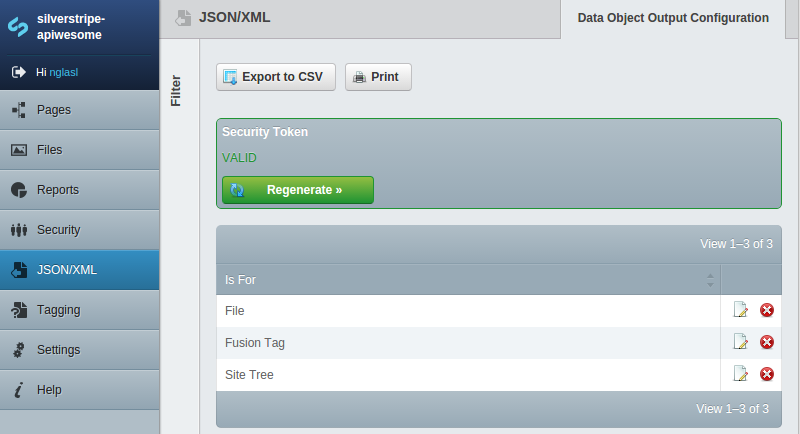
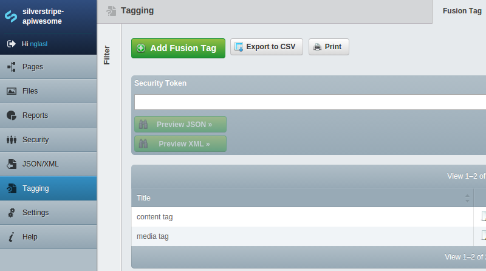

# [apiwesome](https://github.com/nglasl)

_The current release is **1.0.0**._

_The current stable branch is **1.0**._

	A module for SilverStripe which will automatically create customisable JSON/XML feeds for your data
	objects.

## Requirement

* SilverStripe 3.0.X or 3.1.X

## Getting Started

* Place the module under your root project directory.
* Define any custom JSON/XML data object exclusions/inclusions through project configuration.
* `/dev/build`
* Select `JSON/XML` through the CMS.
* Configure attribute visibility.
* `Regenerate` the security token `x:y`
* `/apiwesome/retrieve/data-object-name/json?token=x:y`
* `/apiwesome/retrieve/data-object-name/xml?token=x:y`

## Overview

### Data Object Exclusions/Inclusions

All data objects are included by default (excluding most core), unless disabled or inclusions have explicitly been defined.

```php
DataObjectOutputConfiguration::customise_data_objects('exclude', array(
	'DataObjectName'
));
```

```php
DataObjectOutputConfiguration::customise_data_objects('include', array(
	'DataObjectName'
));
```

```php
DataObjectOutputConfiguration::customise_data_objects('disabled');
```

### Attribute Visibility Customisation

The JSON/XML feed will only be available to data objects with attribute visibility set through the CMS. Any `has_one` relationships may be displayed, where attribute visibility is determined recursively.

### Security Token

A JSON/XML feed request will require the current security token passed through, where this may be regenerated by an administrator (invalidating the previous security token).



### Output

A JSON/XML feed request may have a number of optional filters applied, where `&filter` will only apply for a visible attribute:

* `&limit=5`
* `&filter=Attribute,value`
* `&sort=Attribute,ORDER`

It may also be previewed through the appropriate model admin of your data object.



### Developer Functionality

#### PHP

Accessing the service:

```php
$service = Singleton('APIwesomeService');
```

The methods available may be programmatically called to generate JSON, with optional filters:

```php
$JSON = $service->retrieve('DataObjectName', 'JSON');
$JSON = $service->retrieve('DataObjectName', 'JSON', 5, array('Attribute', 'value'),
	array('Attribute', 'ORDER'));
```

```php
$objects = DataObjectName::get()->toNestedArray();
$JSON = $service->retrieveJSON($objects);
```

XML, with optional filters:

```php
$XML = $service->retrieve('DataObjectName', 'XML');
$XML = $service->retrieve('DataObjectName', 'XML', 5, array('Attribute', 'value'),
	array('Attribute', 'ORDER'));
```

```php
$objects = DataObjectName::get()->toNestedArray();
$XML = $service->retrieveXML($objects);
```

JSON/XML for a versioned page (though the CMS may not correctly preview XML), with regard to the respective stage in `index()`:

```php
return $service->retrieveStaged($this->data()->ID, 'JSON');
```

They may also be used to parse JSON/XML from another APIwesome instance. Therefore, this module may be used as both an API and external connector between multiple projects.

```php
$objects = $service->parseJSON($JSON);
```

```php
$objects = $service->parseXML($XML);
```

#### jQuery

JSON example:

```javascript
;(function($) {
	$(window).load(function() {

		$.getJSON('//ss3.1/apiwesome/retrieve/data-object-name/json?token=' + token(), function(JSON) {

			// Iterate over each data object. This line will NOT change.

			$.each(JSON['DataObjectList'], function(index, object) {

				// The JSON feed security token is no longer valid!

				if((index === 'Expired') && (object === true)) {
					return false;
				}

				// Iterate over each visible attribute.

				$.each(object['DataObjectName'], function(attribute, value) {
				});
			});
		})

		// The JSON feed has not yet been configured.

		.fail(function() {
		});

	});
})(jQuery);
```

## Maintainer Contact

	Nathan Glasl, nathan@silverstripe.com.au
